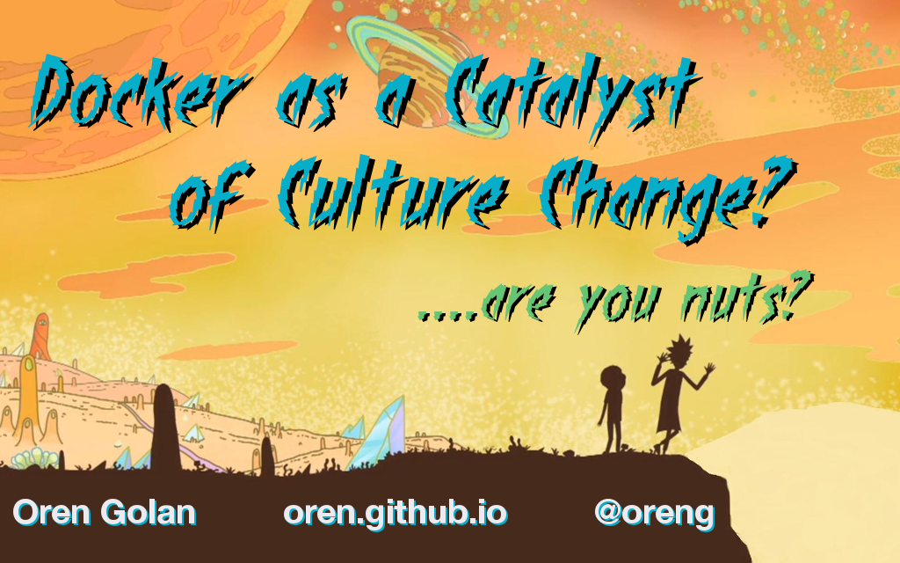

# Docker and a catalyst of culutre change? ...are you nuts?

Presentation at [Full Stack Toronto](http://eventmobi.com/fstoconf15/agenda/118605/614031)

(Click on the image above to watch the video of the talk)

## Description

Docker is here to stay whether you like it or not. so embrace it.  
In this talk I'll explain how Docker, Micro Services and Conway Law are going to change not only the way we write software but also the social structure of the entire organization.
I'll talk about Lean, CI and CD and how they are all playing nice with their new friend, Docker.
But I will not stop at theory. I'll dive into the code, tools and technologies that transforms our company, Sanguine BioSciences, and can help all of the attendees.

## Slides

### 00:00 Crash course on Lean

### 00:00 Docker

* 00:00 What pain is Docker trying to solve?</mark></li>
* 00:00 What is Docker?
* 00:00 Docker for development workflow
* 00:00 Docker for deployment workflow

### 00:00 Graph Databases

### 00:00 Function as a service

## Links to Videos and Demos

* Demo of Dockerizing research.sanguinebio.com - https://www.youtube.com/watch?v=dbWyiNrEsWc
* Demo of running Gollum wiki in Docker - https://www.youtube.com/watch?v=EauxgxsLDC4
* Demo of running Dokuwiki in Docker - https://www.youtube.com/watch?v=uX4doKQsRnQ
* Demo of deploying an app with Deis - https://asciinema.org/a/17792
* Demo of scaling an app with Deis - https://asciinema.org/a/17793
* Demo of Convox - https://www.youtube.com/watch?v=5BWa6BkzCX4
* Demo of Neo4j - https://www.youtube.com/watch?v=wVkKWODHTHQ
* Demo of Cayley - https://www.youtube.com/watch?v=J5o2Uh1JxKw
* JAWS framework trailer - https://vimeo.com/141176732
* JAWS talk from re:invent - https://www.youtube.com/watch?v=D_U6luQ6I90

## References

* Strangler Application:  http://martinfowler.com/bliki/StranglerApplication.html
* Docker Ecosystem series:  https://www.digitalocean.com/community/tutorial_series/the-docker-ecosystem
* Conway Law: http://www.thoughtworks.com/insights/blog/demystifying-conways-law
* Inverse Conway Maneuver: http://www.thoughtworks.com/radar/techniques
* The twelve-factor app - http://12factor.net/build-release-run
* Lean Enterprise: How High Performance Organizations Innovate at Scale - http://www.amazon.com/Lean-Enterprise-Performance-Organizations-Innovate/dp/1449368425

## Run this presentation

    docker-compose up

open [http://localhost](http://localhost)

## Deploy with Convox

    git push
